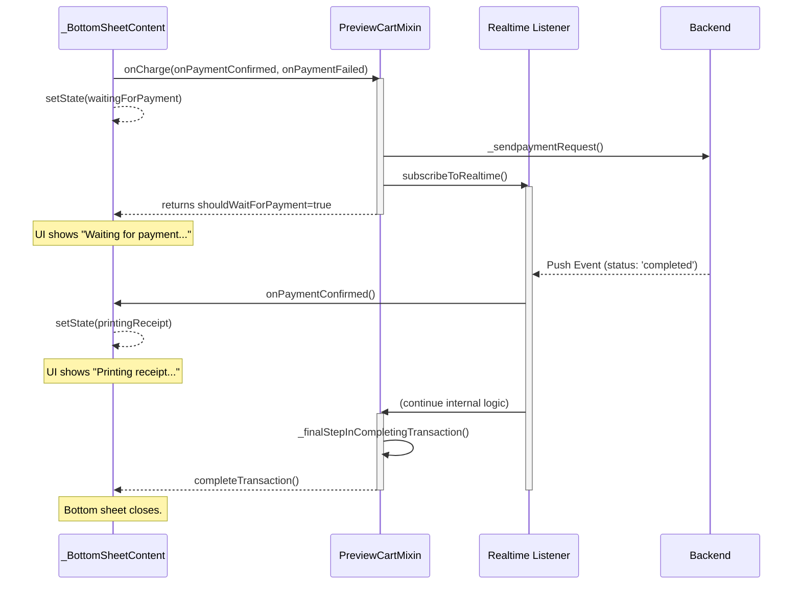

# Modification Design: Robust Payment Confirmation Flow

## 1. Overview

This document outlines the design for improving the digital payment confirmation flow within the Flipper application. The current implementation fails to properly wait for asynchronous payment confirmation from the backend, leading to a confusing user experience. The charge button shows a "waiting for payment" state but doesn't correctly transition after the payment is completed.

This modification will refactor the communication between the payment bottom sheet (`bottomSheet.dart`) and the payment processing logic (`previewCart.dart`) to ensure the UI accurately reflects the true state of the payment process—from initiation, to waiting for confirmation, to finalization.

## 2. Problem Analysis

The core of the problem lies in the disconnect between the UI state managed in `bottomSheet.dart` and the asynchronous payment confirmation received in `previewCart.dart`.

1.  **State Management:** The UI in `bottomSheet.dart` uses a simple boolean (`_isWaitingForPayment`) to represent the waiting state. This is insufficient to represent all the states of the payment process (e.g., "Printing receipt").
2.  **Asynchronous Communication:** The `_processDigitalPayment` function in `previewCart.dart` sets up a realtime listener for payment confirmation. However, there is no robust mechanism to communicate the result of this asynchronous operation (success or failure) back to the UI in `bottomSheet.dart`.
3.  **Premature State Changes:** The existing logic can lead to the "waiting" UI being dismissed prematurely or the app failing to transition to a "completed" or "printing" state, as the UI does not wait for the realtime listener to receive the `completed` signal.
4.  **Error Handling:** If the realtime subscription fails or times out, the UI can get stuck in the "waiting for payment" state indefinitely, with no feedback provided to the user.

The user's goal is clear: the button's state must be directly tied to the payment confirmation received from the backend.

## 3. Alternatives Considered

### Alternative 1: Local Polling

Instead of using a realtime subscription, the app could periodically poll a backend endpoint to check the payment status.

*   **Pros:** Simpler to implement if a realtime backend is not available or reliable.
*   **Cons:** Inefficient, introduces delays in confirmation, and increases server load. The project already uses a realtime subscription service (`supabase_models`), so this would be a step backward.

### Alternative 2: Dedicated StateNotifier Provider

A dedicated Riverpod `StateNotifierProvider` could be created to manage the payment state across all relevant widgets.

*   **Pros:** Creates a single, decoupled source of truth for the payment state, which is a very clean architectural pattern.
*   **Cons:** This would require a more significant refactoring of the existing logic, which is currently managed within the `PreviewCartMixin`. For the scope of this specific problem, it might be overkill. The existing callback-based structure can be fixed with less intrusive changes.

## 4. Detailed Design (Chosen Approach)

The chosen approach is to enhance the existing architecture by introducing an explicit state machine for the charge button and using callbacks to reliably communicate state changes from the backend logic to the UI. This is the most direct and least disruptive way to achieve the desired behavior.

### 4.1. State Machine for the Charge Button

To manage the button's lifecycle, a new `enum` will be introduced in `bottomSheet.dart`.

```dart
enum ChargeButtonState {
  initial, // "Charge"
  waitingForPayment, // "Waiting for payment..."
  printingReceipt, // "Printing receipt..."
  failed, // "Payment Failed. Retry?"
}
```

The `_BottomSheetContentState` will hold a state variable `_chargeState`, which will control the button's appearance and behavior.

### 4.2. Refactoring `bottomSheet.dart`

1.  The `_handleCharge` function will be modified to set the state to `ChargeButtonState.waitingForPayment` immediately upon invocation. This provides instant user feedback.
2.  The `onCharge` function prop (which maps to `startCompleteTransactionFlow`) will be modified to accept two new callbacks: `onPaymentConfirmed` and `onPaymentFailed`.
3.  `_handleCharge` will implement these callbacks:
    *   `onPaymentConfirmed`: Will set `_chargeState` to `ChargeButtonState.printingReceipt`.
    *   `onPaymentFailed`: Will set `_chargeState` to `ChargeButtonState.failed` and display an error.

### 4.3. Refactoring `previewCart.dart`

1.  The `startCompleteTransactionFlow` and `_processDigitalPayment` function signatures will be updated to accept the `onPaymentConfirmed` and `onPaymentFailed` callbacks.
2.  **Inside the `subscribeToRealtime` listener:**
    *   Upon receiving a `completed` status, the `onPaymentConfirmed()` callback will be invoked immediately. This will trigger the UI update in `bottomSheet.dart` to show "Printing receipt...". The logic will then proceed to `_finalStepInCompletingTransaction` as it does now.
    *   The `completeTransaction()` callback (which closes the sheet) will only be called after all finalization steps are complete.
3.  **Error Handling:**
    *   The `onError` block of the listener will invoke the `onPaymentFailed()` callback.
    *   A timeout will be added to the payment listening process. If no confirmation is received within a reasonable period (e.g., 60 seconds), the `onPaymentFailed()` callback will be triggered to prevent the UI from hanging indefinitely.

### 4.4. Sequence Diagram

This diagram illustrates the new, robust communication flow.



## 5. Summary of Design

This design introduces a simple state machine and a clear callback-based communication channel to fix the payment confirmation flow. It ensures that the UI provides immediate and accurate feedback to the user at every step of the process. By adding explicit callbacks for success (`onPaymentConfirmed`) and failure (`onPaymentFailed`), we decouple the UI state from the complex asynchronous logic in the mixin, making the system more robust and predictable.

## 6. Research and References

*   **Flutter UI and State Management:** The design adheres to standard Flutter state management principles where a `StatefulWidget` manages its own transient UI state.
    *   [Flutter Documentation: State Management](https://docs.flutter.dev/data-and-backend/state-mgmt/options)
*   **Handling Asynchronous Operations:** The use of `async/await` with callbacks is a standard pattern for handling long-running operations with UI updates.
    *   [Dart Documentation: Asynchrony](https://dart.dev/language/async)
