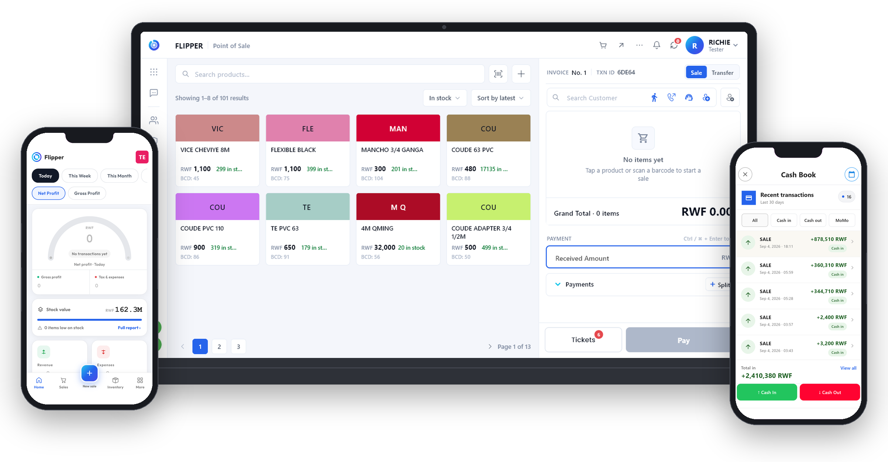

<div align="center">


# Flipper

### Offline-first point of sale, inventory, accounting and HR for small businesses

**Flipper POS** (point of sale & inventory), **Flipper Books** (accounting) and **Flipper HR** share one account on iOS, Android, Windows, macOS, Linux and the web. Sales post to the books automatically, receipts are tax-compliant (including Rwanda Revenue Authority EBM/VSDC receipts), and it keeps selling when the internet drops. Built by [Yegobox](https://yegobox.com) in Kigali, used in Rwanda, Zambia and Mozambique, sold worldwide.

</div>

<div align="center">
  <a href="https://apps.apple.com/rw/app/flipperrw/id6711352372"></a>
  <a href="https://play.google.com/store/apps/details?id=rw.flipper"></a>
  <a href="https://www.microsoft.com/store/productId/9PG12JB1WRGZ"></a>
  <a href="https://useflipper.com"></a>
  <br/>
</div>

<div align="center">

[Website](https://yegobox.com) · [Flipper POS](https://yegobox.com/flipper) · [Pricing](https://yegobox.com/pricing) · [FAQ](https://yegobox.com/faq) · [Sign up](https://useflipper.com/signup) · [Support on WhatsApp](https://wa.me/250788360058)

</div>

<div align="center">

[](https://crowdin.com/project/flipper)

</div>

<div align="center">

&ensp;



</div>

## What is Flipper?

Flipper is a suite of business apps for shops, pharmacies, restaurants, hotels and wholesalers:

| App | What it does | Where |
|---|---|---|
| **Flipper POS** | Offline-first point of sale and inventory: barcode checkout, multi-branch stock, purchases, transfers, recounts, cash / MTN Mobile Money / card payments, tax-compliant receipts (RRA EBM in Rwanda) | iOS, Android, Windows, macOS, Linux, web |
| **Flipper Books** | Accounting that fills itself in — every POS sale posts a journal entry at sale time; expenses, recurring entries, P&L and balance sheet | Web ([useflipper.com](https://useflipper.com)), desktop |
| **Flipper HR** | Staff records, invitations, roles and leave, on the same account | Web |
| **Rows** | Live dashboards and daily reports from POS data | Web |

Plans start at **RWF 5,000 / month** for POS on one phone; see [pricing](https://yegobox.com/pricing). Card payments are accepted from any country.

This monorepo contains the client applications (source-available). Backend services and keys are private.

## Key features

-   **Works offline** — every sale is saved on the device first and synced when a connection is available.
-   **One account, every app** — a cashier in POS is the same identity in Books and HR.
-   **POS-first accounting** — no month-end import; the ledger is written as you sell.
-   **Tax compliance built in** — RRA EBM/VSDC receipts, refunds, proformas and stock reports in Rwanda.
-   **Payments customers use** — cash, MTN MoMo, card; split payments and till settlement.
-   **Cross-platform** — one Flutter codebase for six platforms.

## 🛠️ Getting Started: Repository Setup

This repository is a monorepo managed with [Melos](https://melos.invertase.dev/).

1.  **Clone the repository**:
    ```bash
    git clone https://github.com/yegobox/flipper.git
    cd flipper
    ```

2.  **Activate Melos**:
    ```bash
    dart pub global activate melos 6.3.2
    ```

3.  **Bootstrap the project**:
    This command links all local packages and installs dependencies.
    ```bash
    melos bootstrap
    ```

4.  **Enable repo git hooks** (one-time):
    ```bash
    git config core.hooksPath hooks
    ```
    This also installs `post-checkout`/`post-merge` hooks that **automatically
    sync submodules** to the commit each branch pins on every `git switch` and
    `git pull` — so you never build against a stale submodule.

### Manual Configuration

For security reasons, some configuration files containing sensitive information are not included in the repository. You will need to create them manually.

1.  **Secret Files**:
    -   `packages/flipper_models/lib/secrets.dart`: Contains the `AppSecrets` class with API keys and endpoints.
    -   `apps/flipper/lib/firebase_options.dart`: Contains the `DefaultFirebaseOptions` class with Firebase configuration.

2.  **API Keys**:
    You'll need to obtain and configure your own API keys for services like Payment gateways (PayStack), Cloud storage, Analytics, Firebase, Sentry, and Supabase.

For templates and detailed setup instructions, please contact us at `info@yegobox.com`.

Additional implementation guides:

- [Flipper Sync Framework](docs/ditto_sync.md)

### 🪟 Running on Windows (local)

CI builds the Windows app on GitHub's `windows-latest` runners, which come
pre-provisioned and run elevated. A local machine needs a few extra steps that
CI gets for free:

1.  **Submodules** are kept in sync automatically by the git hooks (setup step 4)
    on every branch switch and pull. If one ever gets stuck at the wrong commit
    (e.g. it has local changes the hook won't overwrite), force-reset them:
    ```bash
    git submodule update --init --force --recursive
    ```

2.  **Install the Rust toolchain**. `turso_dart` builds a Rust native library via
    a `hook/build.dart` and requires `rustup`/`cargo` on `PATH` (GitHub runners
    ship with Rust pre-installed). After installing, open a fresh terminal:
    ```powershell
    winget install Rustlang.Rustup
    rustup default stable
    ```

3.  **Run via the helper script**, which bundles every local workaround (Rust on
    PATH, per-source PDBs, and turso DLL recovery) so you don't have to remember
    them:
    ```powershell
    powershell -ExecutionPolicy Bypass -File scripts\run-windows.ps1
    ```
    (works on stock Windows PowerShell 5.1; `pwsh` works too if you have it).
    It runs `flutter run -d windows`; extra args are forwarded.

#### Why the workarounds are needed (and the real fix)

On-access antivirus (e.g. **Bitdefender**, IPA's managed endpoint AV) interferes
with the build directory in two ways:

- It locks freshly written `.pdb`/`.ilk`/`.tlog` files mid-link → scattered
  `C1041` / `LNK1104` / `MSB6003 "used by another process"` errors. The script
  sets `UseMultiToolTask=true` (one PDB per source) to sidestep this.
- It grabs `turso_dart_native.dll` as cargo links it from `release\deps\` to the
  `release\` root, so Flutter's `install_code_assets` can't find it. The script
  restores the DLL and retries.

**The durable fix is an antivirus exclusion** for the repo's `build\` and
`.dart_tool\` folders, after which the script's workarounds become unnecessary.
On a managed device you usually can't set this yourself — request it from IT.
At IPA: email `support@poverty-action.org` asking for an on-access scanning
exclusion for your local clone path (e.g. `C:\...\flipper\`).

Note: don't run two Windows builds against the same checkout at once — concurrent
builds write the same PDBs and fail with `C1041`.

## 🤝 Contributing

We welcome contributions from the community! If you're interested in helping improve Flipper, please follow these steps:

1.  **Contact Us First**: Before starting any work, please email us at `info@yegobox.com` with your proposal or idea. This helps us coordinate efforts and prevent duplicate work.
2.  **Fork & Pull Request**: Use the standard GitHub workflow. Fork the repository, create a new branch for your feature or fix, and submit a pull request.
3.  **Follow Code Style**: Adhere to the existing code style and patterns within the project to maintain consistency.
4.  **Write Tests**: Ensure your changes include appropriate tests and that all existing tests pass.
5.  **Help Translate**: Join the [Flipper Crowdin project](https://crowdin.com/project/flipper) to improve translations for the community.

## 🛡️ Security

Security is fundamental to our mission. We encourage responsible disclosure of potential vulnerabilities.
-   **Email**: `yegobox@gmail.com`
-   **Submit an Advisory**: [Create a new security advisory](https://github.com/yegobox/flipper/security/advisories/new)

For complete details, please review our [security policy](SECURITY.md).

## 📈 For Investors

Flipper presents a strategic opportunity for investors targeting high-growth potential in the B2B SaaS and data security markets. The business software market is projected to reach $650B by 2028, driven by the growing demand for integrated and scalable solutions. Flipper is at the forefront, helping businesses automate operations, optimize workflows, and gain real-time insights.

Our next funding round will accelerate:
-   Enterprise user acquisition
-   UI/UX improvements and R&D
-   Expansion of AI-powered business intelligence tools
-   Global compliance and certification programs

## 📜 License & Terms of Use

This project is source-available. The source code is public on GitHub to promote transparency and build trust with our users and partners. However, it is not "open source" in the conventional sense.

Usage of this source code is subject to specific terms. You may use, modify, and distribute the code only if you have a valid agreement with YEGOBOX LTD, or if you are an acknowledged investor, contributor, or partner. Unauthorized use is strictly prohibited. For licensing inquiries, please contact `info@yegobox.com`.
